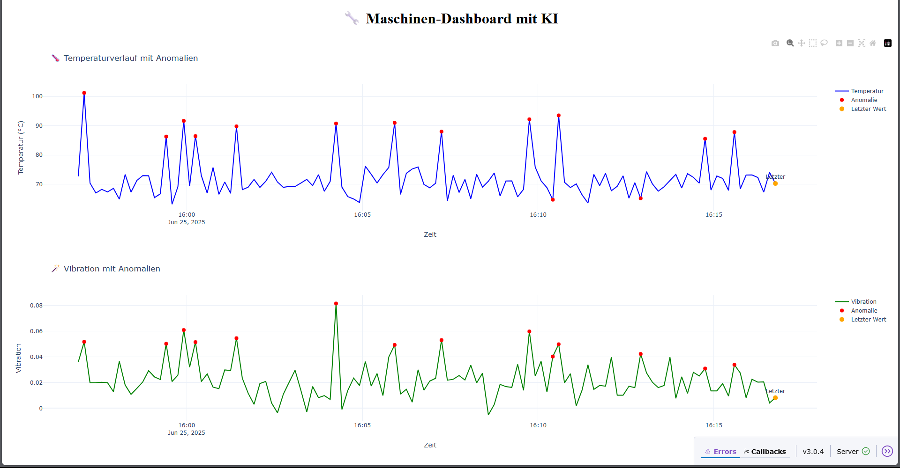

# 🧠 Machine-KI-Dashboard

Ein interaktives Dashboard zur Visualisierung und KI-gestützten Analyse von Maschinendaten (Temperatur & Vibration). Entwickelt zur Demonstration moderner Anwendungsfälle im Sondermaschinenbau – mit Fokus auf **Künstliche Intelligenz**, **Visualisierung** und **digitale Schulungssysteme**.

---

## 👨‍🎓 Über mich

**Eyüp Cindioglu**  
Studierender im Fachbereich **Informatik**  
Hochschule Kempten  
🔍 Bewerbung für ein Pflichtpraktikum bei **Bosch – Sondermaschinenbau (KI & Visualisierung)**

---

## 🎯 Ziel des Projekts

Dieses Projekt zeigt praxisnah, wie man:

- 📡 Maschinenzustände in Echtzeit überwacht  
- 🤖 mit KI automatisch Anomalien erkennt  
- 📊 ein modernes Dashboard für Bediener, Entwickler oder Schulungsteilnehmer gestaltet

---

## 🔍 Funktionen im Überblick

- **Live-Datenanzeige**: Automatisch aktualisierte Diagramme alle 5 Sekunden  
- **Anomalieerkennung** mit KI (Isolation Forest)  
- **Zwei Live-Diagramme**:  
  - Temperaturverlauf mit Anomalien (blau + rot)  
  - Vibrationsverlauf mit Anomalien (grün + rot)  
- **Farbliche Hervorhebung**: Rote Punkte = erkannte Störungen  
- **Zeitachse**: Realtime-Daten mit Zeitstempeln  
- **Datenquelle anpassbar**: Eigene CSV-Dateien oder Echtzeitsimulation möglich  

---

## 📸 Vorschau



---

## ⚙️ So benutzt du das Projekt

### 1. Repository klonen

```bash
git clone https://github.com/Trayute/machine-ki-dashboard.git
cd machine-ki-dashboard
```

### 2. Abhängigkeiten installieren

Am besten in einer virtuellen Umgebung:

```bash
pip install -r requirements.txt
```

### 3. Dashboard starten

```bash
python dashboard.py
```

🔗 Das Dashboard öffnet sich im Browser unter:  
[http://127.0.0.1:8050/](http://127.0.0.1:8050/)

---

## 👀 Was du im Dashboard sehen kannst

- 🔵 **Live-Temperaturverlauf** (blau)  
- 🟢 **Live-Vibrationsverlauf** (grün)  
- 🔴 **Anomalien** (rote Marker im Diagramm)  
- 📅 **Zeitachse** mit Sekundengenauigkeit  
- 📈 **KI-basierte Analyse**, live auf aktuellem Datenstrom

---

## 🧪 Datenquelle

Die Datei `data/machine_data_with_anomalies.csv` enthält:

| Spalte       | Beschreibung                  |
|--------------|-------------------------------|
| `time`       | Zeitstempel                   |
| `temperature`| Temperaturwert in °C          |
| `vibration`  | Vibrationsstärke              |
| `anomaly`    | `-1` = Anomalie, `1` = normal |

### 👉 Eigene Daten simulieren?

```bash
python generate_dummy_data.py
```

Oder kontinuierlich im Hintergrund:

```bash
python simulate_data.py
```

---

## 🧠 KI-Logik: Isolation Forest

- Die Anomalieerkennung basiert auf dem **Isolation Forest**-Algorithmus aus `scikit-learn`.
- Das Modell wird auf normalem Verhalten trainiert.
- Danach erkennt es automatisch ungewöhnliche Werte (Ausreißer) in Temperatur & Vibration.

---

## 📁 Projektstruktur

```text
machine-ki-dashboard/
├── data/
│   └── machine_data_with_anomalies.csv
├── dashboard.py
├── analyze_data.py
├── generate_dummy_data.py
├── simulate_data.py
├── requirements.txt
└── README.md
```

---

## 📦 requirements.txt

```txt
dash==3.0.0
pandas==2.2.2
plotly==5.20.0
scikit-learn==1.4.2
```

Installation:

```bash
pip install -r requirements.txt
```

---

## 📌 Einsatzszenarien

| Bereich                | Nutzen                                                  |
|------------------------|---------------------------------------------------------|
| 👷 Schulungen           | Echtzeit-Dashboard für Bedienerschulungen              |
| 🧪 Tests & Entwicklung  | Anomalie-Erkennung mit simulierten Maschinendaten      |
| 🛠️ Wartung & Diagnose   | Visualisierung von Störungen zur Ursachenanalyse       |
| 📊 Industrie 4.0        | Darstellung und Interpretation von Maschinendatenströmen |
| 🤖 KI-Demonstration     | Modellierung von KI-Anwendungen im Maschinenumfeld     |

---

## 🤝 Motivation & Bewerbung

Dieses Projekt demonstriert meine Fähigkeiten in:

- **Künstlicher Intelligenz** (ML, Anomalie-Erkennung)  
- **Visualisierung** mit Dash & Plotly  
- **Datenanalyse & Simulation**  
- **Systemintegration im industriellen Kontext**

Es wurde speziell für eine Bewerbung bei **Bosch Immenstadt – Sondermaschinenbau** erstellt, mit dem Ziel, die **Zukunft der Standardisierung und digitalen Visualisierung aktiv mitzugestalten**.

---

## 📬 Kontakt

**Eyüp Cindioglu**  
📍 Hochschule Kempten  
✉️ eyuepcindioglu@hotmail.com  
🔗 [github.com/Trayute://github.com/Trayute

---

## 📝 Lizenz

**MIT License**  
Freie Nutzung für Lern-, Forschungs- und Entwicklungszwecke.

---

## 🔁 GitHub
git remote add origin https://github.com/Trayute/machine-ki-dashboard.git
git push -u origin main
```
